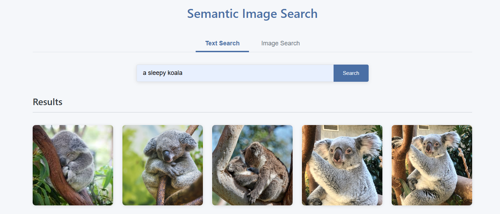
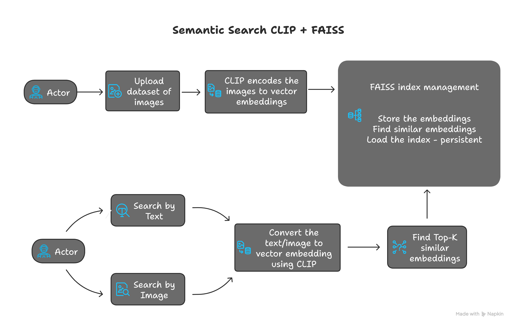
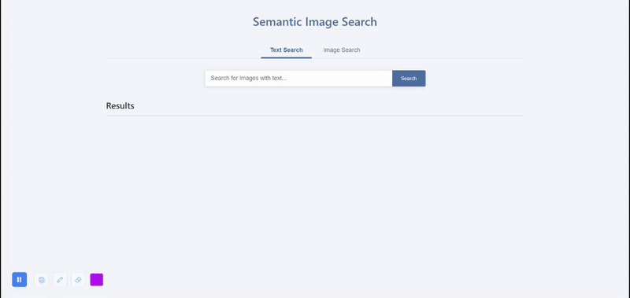

# Semantic Image Search with CLIP + FAISS



A semantic image search engine using OpenAI's CLIP and Meta's FAISS.


##  Tech Stack

- **CLIP (OpenAI)**: Image and text embeddings.
- **FAISS (Meta)**: Similarity search.
- **Flask**: Web server.
- **PyTorch**: Deep learning.
- **JavaScript/HTML/CSS**: Frontend.

## Architecture Overview


- **Indexing**: Images are converted to numerical vectors (embeddings) by CLIP and stored in FAISS.
- **Text Search**: Text query is converted to an embedding; FAISS finds images with closest embeddings.
- **Image Search**: Uploaded image is converted to an embedding; FAISS finds images with closest embeddings.

## Installation

1.  **Clone**: `git clone https://github.com/surajrao2003/semantic_search_clip_faiss.git && cd semantic_search_clip_faiss`
2.  **Virtual Environment** (recommended):
    ```bash
    python -m venv venv
    # Windows: .\venv\Scripts\activate
    # Linux/Mac: source venv/bin/activate
    ```
3.  **Dependencies**: `pip install -r requirements.txt`
    (For GPU support, install PyTorch with CUDA.)

## Usage

### 1. Prepare Images
   Place your images in a directory (e.g., `images/`). Subdirectories for categories are optional but good practice.
   ```
   images/
     ├── category1/
     │   ├── image1.jpg
     └── category2/
         └── image2.jpg
   ```

### 2. Index Images
   ```bash
   python index.py --image_dir path/to/your/images
   ```
   This creates `static/index.faiss` and `static/image_paths.json`.

### 3. Run Web Server
   ```bash
   python serve.py
   ```
   Open `http://localhost:5000` in your browser.

### 4. Search
   - **Text Search**: Use the "Text Search" tab.
   - **Image Search**: Use the "Image Search" tab (drag & drop or upload).



## Project Structure

```
.
├── app.py                # Core application (CLIP model, search logic)
├── index.py              # Image indexing script (CLIP encoding and FAISS index creation)
├── serve.py              # Flask web server routes
├── requirements.txt      # Dependencies
├── static/               # Static assets (CSS, JS, FAISS index, dataset, uploads)
├── templates/            # HTML templates (index.html)
├── demo.gif, demo.png, flowchart.png # Demo and diagram assets
```


## Customization Options

- **CLIP Model**: Change in `app.py` and `index.py` (e.g., `ViT-L/14`).
- **Number of Results**: Adjust `results` parameter in search functions in `app.py`.
- **UI**: Modify `static/styles.css` and `templates/index.html`.
- **Uploads**: Configure in `serve.py` (e.g., `MAX_CONTENT_LENGTH`).

## Acknowledgments

- [OpenAI CLIP](https://github.com/openai/CLIP)
- [FAISS](https://github.com/facebookresearch/faiss)
